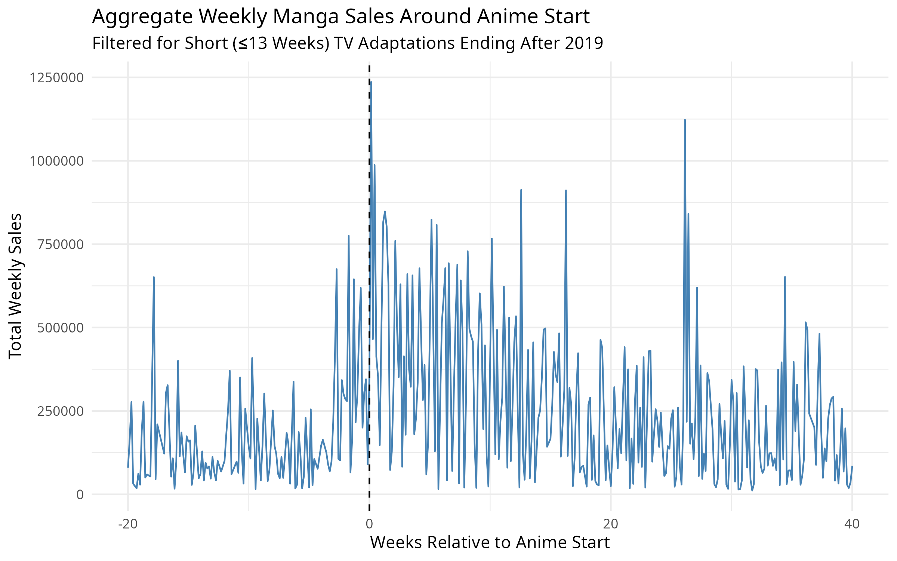
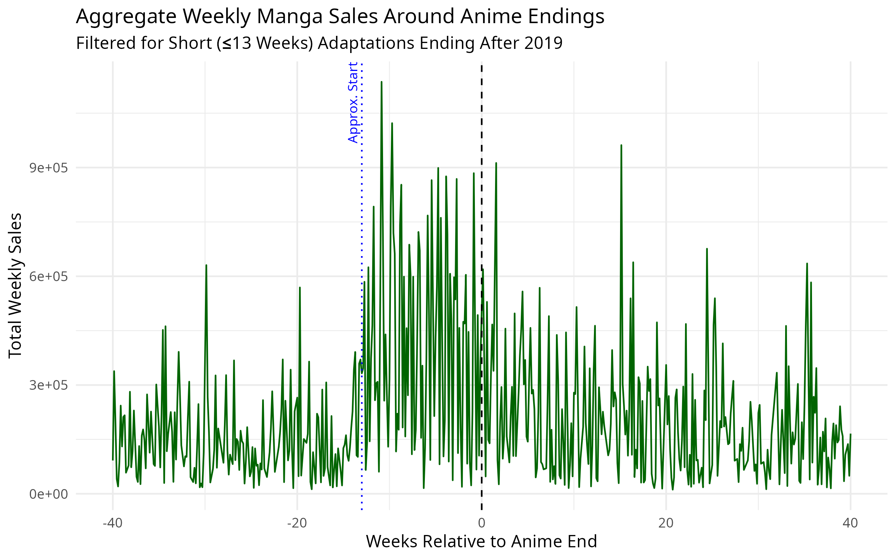
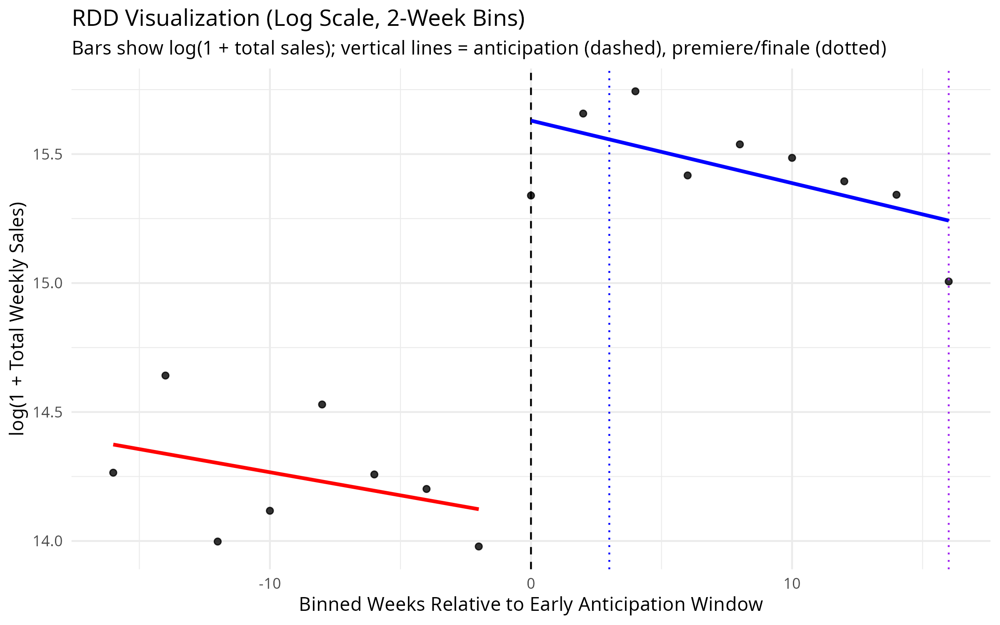
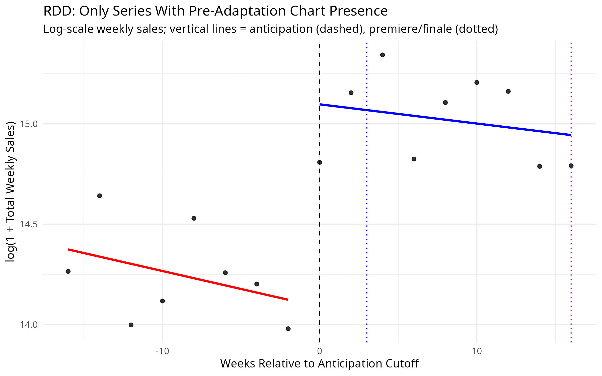

---
output:
  pdf_document: default
  html_document: default
---
# From Screen to Page: How Anime Adaptations Influence Manga Sales

## Abstract
Understanding audience engagement is central to effective marketing and media strategies. This study employs a regression discontinuity design (RDD) on weekly manga sales around key anime adaptation dates to estimate the causal impact of anime adaptations on manga sales. While anime premieres and finales show minimal direct effects, pre-release advertisements substantially boost manga sales approximately three weeks prior to airing, highlighting the power of marketing as a driver of consumer interest.

## Introduction
Adaptations have long been pivotal in entertainment, transforming written stories into visual spectacles. Classic fairy tales such as *Cinderella* and *Snow White* began as literary works, evolved into animated films, and eventually inspired live-action remakes. Films like *The Wizard of Oz* (1939) and *Harry Potter* (2001) further demonstrate the central role adaptations play in media economics. Recently, video games like *League of Legends* have joined this trend with shows such as *Arcane* (2021).

However, studying adaptation effects can be challenging due to limited public data from private entertainment companies. To address this, we utilize accessible data from Japanese anime and manga to analyze how anime adaptations influence manga sales.

Anime traditionally involves meticulous frame-by-frame animation, often adapted directly from manga—Japan’s popular graphic novels. While many anime series originate from manga, not every manga is adapted, nor are all anime adaptations faithful or successful.

This paper examines how anime adaptation events, specifically season premieres and finales, influence manga sales. Using regression discontinuity design on weekly manga sales data aligned with adaptation dates, we analyze whether anime broadcasts trigger significant changes in manga consumption.

## Data
The analysis relies on a comprehensive dataset combining weekly manga sales from MangaCodex.com with anime metadata from AniList.

### Weekly Manga Sales Data
Weekly sales data were collected from MangaCodex, a repository of Oricon’s manga sales rankings. Oricon is a renowned Japanese firm known for accurate entertainment market data.

- Web crawlers identified and collected URLs of weekly manga sales charts.
- Data from these URLs were scraped and stored in CSV files.
- CSV files were combined and extensively cleaned to correct inconsistencies, missing data, and typographical errors, ensuring accurate title matching.

### Anime and Manga Metadata
Detailed anime adaptation metadata were obtained through the AniList API, which provides structured and comprehensive information about anime and manga, including adaptation status and broadcast dates.

- Queries to the AniList API retrieved titles, formats, and adaptation relationships.
- Official Romaji titles from AniList standardized the title matching process.

### Title Matching
Merging MangaCodex and AniList data required fuzzy matching due to discrepancies in naming conventions:

- Typos and naming inconsistencies within MangaCodex listings.
- Non-standard naming practices, including serialization names and volume-specific identifiers.

A token-based fuzzy string matching algorithm aligned sales data with accurate AniList metadata. This merged dataset enabled precise tracking of manga sales relative to anime adaptation events.

## Analysis
Anime premieres were utilized as proxies for heightened consumer visibility. The analysis was confined to TV-broadcast anime, the most prevalent and marketed adaptation form. Initial visualizations demonstrated manga sales trends around critical anime release windows:

A notable sales spike appears roughly three weeks before anime premieres, corresponding with peak advertising periods in Japan. This observation guided the subsequent regression discontinuity analysis.

An RDD was applied using two-week bins around the estimated advertising window. Weekly manga sales were log-transformed to stabilize variance:

Initial RDD results confirmed a significant sales increase coinciding with pre-anime advertisements.

## Results
Popularity and manga release dates primarily drive manga sales. Our analysis supports a significant pre-premiere sales spike, attributed to heightened advertising and consumer anticipation. This spike underscores how anime advertisements effectively stimulate manga sales prior to broadcast.

Contrary to expectations, anime finales did not yield significant changes in manga sales, suggesting minimal direct migration from anime viewers to manga readers post-broadcast. This indicates either a balanced shift in consumer interest or negligible cross-media migration within the Japanese market.

The advertising-driven sales spike is robust even after controlling for visibility biases. Many manga series enter sales charts only after anime marketing begins:

| Time Period | Count |
|-------------|-------|
| Pre         | 262   |
| Post        | 1415  |
| Total       | 1677  |

Approximately 50% of manga series appearing post-advertisement had not charted previously, emphasizing advertising's role in elevating overlooked titles. Even after filtering to series present before advertisements, significant sales increases remain visible, affirming the advertising effect:

| Time Period | Count |
|-------------|-------|
| Pre         | 262   |
| Post        | 904   |
| Total       | 1171  |

Thus, anime advertisements act primarily as initial visibility enhancers, driving sustained manga sales rather than immediate post-premiere spikes.

## Conclusion
Anime adaptations primarily boost short-term manga visibility rather than long-term engagement. Manga sales significantly increase in anticipation of anime premieres due to effective pre-release advertising. Post-premiere effects are less clear, with minimal evidence suggesting sustained cross-media engagement. Thus, strategic marketing is critical for maximizing manga sales around anime adaptation events.

## Appendix

### A: Data Collection Procedure
- Web scraping via `requests` and `BeautifulSoup` (Python).
- CSV formatting, error checking, and normalization with `tidyverse` (R).

### B: Fuzzy Matching Algorithm
- Token-based string similarity using Jaccard or Levenshtein distance.
- Manual review of ambiguous matches and adjustment of thresholds.

### C: Additional RDD Visualizations
- Full-size plots for each key event (premiere, finale) across multiple time windows.

### D: Robustness Checks
- Re-estimation of RDD after filtering for series with pre-advertisement chart presence.
- Regression tables and sensitivity diagnostics included in supplementary materials.

### E: GitHub Repository
- [GitHub Repo](https://github.com/ewute/econ-thesis)
Contains full codebase, datasets, and instructions to reproduce all figures and analyses.
