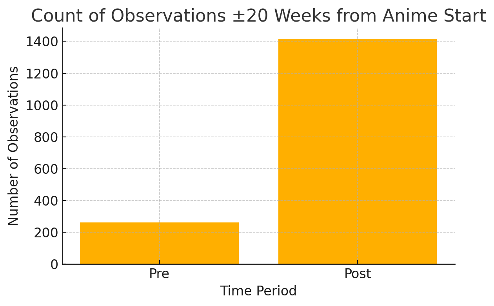

---
output:
  pdf_document: default
  html_document: default
---
# From Screen to Page: How Anime Adaptations Influence Manga Sales

## Abstract
Understanding audience engagement is central to effective marketing and media strategies. This study employs a regression discontinuity design (RDD) on weekly manga sales around key anime adaptation dates to estimate the causal impact of anime adaptations on manga sales. While anime premieres and finales show minimal direct effects, pre-release advertisements substantially boost manga sales approximately three weeks prior to airing, highlighting the power of marketing as a driver of consumer interest. Interestingly, specific genres that translate well onto the screen differentially gain more visibility from advertising than narrative-driven genres.

## Introduction
Adaptations have long been pivotal in entertainment, transforming written stories into visual spectacles. Classic fairy tales such as *Cinderella* and *Snow White* began as literary works, evolved into animated films, and eventually inspired live-action remakes. Films like *The Wizard of Oz* (1939) and *Harry Potter* (2001) further demonstrate the central role adaptations play in media economics. Recently, video games like *League of Legends* have joined this trend with shows such as *Arcane* (2021).

However, studying adaptation effects can be challenging due to limited public data from private entertainment companies. To address this, accessible data from Japanese anime and manga were utilized to analyze how anime adaptations influence manga sales.

Anime traditionally involves meticulous frame-by-frame animation, often adapted directly from manga—Japan’s popular graphic novels. While many anime series originate from manga, not every manga is adapted, nor are all anime adaptations faithful or successful.

This paper examines how anime adaptation events, specifically season premieres and finales, influence manga sales. Whether anime broadcasts trigger significant changes in manga consumption was analyzed, using regression discontinuity design on weekly manga sales data aligned with adaptation dates.

## Institutional Context and Marketing Channels
Anime and manga operate within a tightly integrated media-mix ecosystem in Japan. Publishers often coordinate with animation studios and television networks months before broadcast, with promotional materials—including trailers (PVs), posters, and collaboration campaigns—dropping 2–4 weeks prior to the premiere. These campaigns often target existing manga readers and anime fans through digital platforms (YouTube, Twitter), print advertisements in *Weekly Shonen Jump*, and retail displays in stores like Tsutaya and Animate.

As such, manga sales prior to an anime's debut may reflect consumer response to advertising rather than new audience acquisition. Understanding this institutional pipeline contextualizes the observed three-week pre-release sales spike as a strategic marketing phenomenon, not a byproduct of the broadcast itself.

### Genre Preferences in Anime Adaptations
Anime adaptations often favor visually compelling and narratively engaging genres. Analysis of genre proportions from the AniList database reveals distinct differences in adaptation likelihood based on genre characteristics. Specifically, genres such as **comedy** (56.5% adapted vs. 39.6% non-adapted, difference: +16.8%), **fantasy** (29.9% adapted vs. 22.8% non-adapted, difference: +7.1%), and **action** (32.8% adapted vs. 26.1% non-adapted, difference: +6.8%) are adapted into anime more frequently compared to their proportions among non-adapted manga series.

On the other hand, genres more reliant on intricate narratives rather than visual spectacle, such as **romance** (41.3% adapted vs. 48.1% non-adapted, difference: -6.8%) and **drama** (32.9% adapted vs. 39.5% non-adapted, difference: -6.6%), are slightly less represented among adaptations.

| Genre             | Adapted Proportion | Non-Adapted Proportion | Difference  |
|-------------------|--------------------|------------------------|-------------|
| Comedy            | 56.5%              | 39.6%                  | +16.8%      |
| Fantasy           | 29.9%              | 22.8%                  | +7.1%       |
| Action            | 32.8%              | 26.1%                  | +6.8%       |
| Adventure         | 19.7%              | 13.1%                  | +6.6%       |
| Slice of Life     | 28.2%              | 22.3%                  | +5.9%       |
| Supernatural      | 18.3%              | 13.3%                  | +5.0%       |
| Romance           | 41.3%              | 48.1%                  | -6.8%       |
| Drama             | 32.9%              | 39.5%                  | -6.6%       |

These genre tendencies align narratively with the visual strengths of televised media: flashy action sequences, fantastical worlds, and comedic timing translate effectively to engaging visual storytelling. In contrast, the subtle emotional or narrative-driven storytelling in romance and drama might not translate as easily or immediately to visually captivating television content.

## Data
The analysis relies on a comprehensive dataset combining weekly manga sales from MangaCodex.com with anime metadata from AniList.

### Weekly Manga Sales Data
Weekly sales data were collected from MangaCodex, a repository of Oricon’s manga sales rankings. Oricon is a Japanese information and statistics firm known for entertainment market data. URL's of weekly manga sales charts were collected from web crawling. In which afterwards, the site was scraped and stored in CSV files. The CSV files were cleaned for naming inconsistencies, date errors, and typographical errors. Each week's chart was combined via bash script in which we have our raw data complete and ready for further pre-processing.

### Anime and Manga Metadata
Detailed anime adaptation metadata were obtained through the AniList API, which provides structured and comprehensive information about anime and manga, including adaptation status and broadcast dates. Due to title matching discrepencies between API and MangaCodex titles, the entire database was retrieved so titles could be matched with more accurate algorithms.

### Title Matching
Merging MangaCodex and AniList data required fuzzy matching due to discrepancies in naming conventions like typos and naming inconsistencies within MangaCodex listings. A token-based fuzzy string matching algorithm aligned sales data with AniList metadata by matching the manga charts titles with the respective manga english titles. This merged dataset allows for easy matching with **unique** Romaji titles between manga and anime datasets.

## Analysis
Anime premieres were utilized as proxies for heightened consumer visibility. The analysis was confined to TV-broadcast anime, the most prevalent and marketed adaptation form. Initial visualizations demonstrated manga sales trends around critical anime release windows:

A notable sales spike appears roughly three weeks before anime premieres, corresponding with peak advertising periods in Japan. This observation guided the subsequent regression discontinuity analysis.

An RDD was applied using two-week bins around the estimated advertising window. Weekly manga sales were log-transformed to stabilize variance:

RDD results confirmed a significant sales increase coinciding with pre-anime advertisements.

### Genre-Specific Visibility and Advertising Effects
Directly attributing causal effects by genre is challenging due to the multi-genre nature of manga. However, genre-specific visibility patterns can still offer valuable insights. The table below highlights selected genres, illustrating the proportion of manga series appearing on sales charts **only after** anime-related advertising began:

| Genre          | Total Series | % Never on Chart Pre-Ads |
|----------------|--------------|--------------------------|
| Mecha          | 6            | 100.0%                   |
| Sci-Fi         | 20           | 70.0%                    |
| Horror         | 19           | 57.9%                    |
| Fantasy        | 76           | 53.9%                    |
| Action         | 79           | 53.2%                    |
| Comedy         | 143          | 49.7%                    |
| Romance        | 117          | 40.2%                    |
| Psychological  | 21           | 28.6%                    |

Genres associated with visually striking content (**mecha**, **sci-fi**, **horror**, **fantasy**, and **action**) show higher proportions of manga gaining initial visibility only after advertising, suggesting a strong visual appeal in televised adaptations. Conversely, genres more reliant on narrative depth, such as **romance** and **psychological**, show lower proportions, indicating either established readerships or less advertising-driven visibility gains.

This focused genre comparison underscores how the visual and narrative characteristics of manga genres influence their market response to anime adaptation marketing.

## Results
The analysis reveals that manga sales are primarily influenced by strategic marketing around anime adaptations rather than the broadcasts themselves. Specifically, a significant increase in manga sales occurs approximately three weeks prior to anime premieres, coinciding with the peak advertising period. This spike underscores advertising's critical role in stimulating consumer interest, particularly highlighting manga series previously overlooked by readers.

Contrary to initial expectations, anime finales do not significantly alter manga sales, suggesting limited cross-media migration from anime viewership to manga readership after a series concludes. Instead, the data imply that heightened sales activity predominantly reflects marketing-induced visibility rather than sustained post-premiere engagement.

The genre-specific analysis further enriches these findings. Visually appealing genres such as **mecha**, **sci-fi**, **horror**, **fantasy**, and **action** exhibit higher proportions of series entering sales charts exclusively after anime-related advertisements begin. This indicates that the visual appeal of these genres, amplified through televised formats and promotional content, effectively captures consumer attention and elevates manga visibility.

Conversely, narrative-intensive genres like **romance** and **psychological** show comparatively lower proportions of manga gaining initial chart visibility due to advertising. These genres likely rely on existing reader loyalty and narrative depth rather than visual spectacle, thus receiving diminished marketing-driven visibility boosts.

These genre-based findings underscore the thematic importance of aligning manga characteristics with the visual strengths of televised anime to maximize the effectiveness of promotional efforts.

### Robustness
The advertising-driven sales spike is robust even after controlling for visibility biases. Many manga series enter sales charts only after anime marketing begins:

| Time Period | Count |
|-------------|-------|
| Pre         | 262   |
| Post        | 1415  |
| Total       | 1677  |

Approximately 50% of manga series appearing post-advertisement had not charted previously, emphasizing advertising's role in elevating overlooked titles. Even after filtering to series present before advertisements, significant sales increases remain visible, affirming the advertising effect:

| Time Period | Count |
|-------------|-------|
| Pre         | 262   |
| Post        | 904   |
| Total       | 1171  |

Even after filtering out series that had not appeared on the charts prior to advertising, post-advertisement chart density remains considerably higher. This shows that once visibility is triggered, manga will continue to perform well, remaining on the charts for weeks. It's difficult to determine the cause as though it's likely due to varying degrees of advertisement, anime performance itself, and ongoing consumer momentum. Nonetheless, the initial “buy phase” appears to be sparked by advertising, with anime adaptation acting as a reinforcing mechanism that extends the sales arc rather than initiating it.

## Conclusion
Anime adaptations primarily function as catalysts for short-term manga visibility rather than sustained cross-media engagement. Manga sales notably increase during the period preceding anime premieres due to targeted and effective advertising campaigns. However, the post-premiere period does not yield significant sustained consumer interest, suggesting limited viewer transition from anime to manga readership.

The genre-specific analyses highlight an essential marketing strategy insight: manga genres with strong visual elements (**mecha**, **sci-fi**, **horror**, **fantasy**, and **action**) benefit more substantially from anime adaptations and related promotions. Conversely, genres emphasizing intricate storytelling (**romance**, **drama**, **psychological**) rely less on promotional visibility gains, suggesting alternative market dynamics based on established readership and narrative engagement.

Overall, the findings emphasize the role of marketing and genre alignment in leveraging anime adaptations to maximize manga sales effectively. Marketing strategies and adaptation decisions likely  consider these genre-specific dynamics to optimize audience engagement and commercial success.

## Appendix

### A: Data Collection Procedure
The data collection combined web scraping, API querying, and database management. Weekly manga sales data were gathered via web scraping from MangaCodex.com, an unofficial source for Oricon's manga rankings. The scraping employed Python libraries `requests` and `BeautifulSoup` to send HTTP requests, parse HTML, and systematically store extracted data in structured CSV files. Afterwards, all CSV files were merged into a single comprehensive dataset, covering weekly manga sales from 2009 to 2023.

Metadata detailing anime adaptations were acquired using the AniList API. Python scripts queried the API for comprehensive anime and manga information, such as adaptation relationships, broadcast formats, genres, and release dates. Responses from the AniList API were parsed and structured into CSV files, enabling efficient merging with manga sales data.

### B: Fuzzy Matching Algorithm
To accurately merge manga sales data from MangaCodex with detailed metadata obtained from AniList, a fuzzy matching algorithm was implemented. This algorithm tackled discrepancies caused by different naming conventions, typos, serialization variants, and title language variations (Japanese Romaji versus English titles). Utilizing the `rapidfuzz` library, the matching procedure involved generating similarity scores through token-based matching techniques.

Each title from the sales dataset was systematically compared against an extensive list of official AniList titles, including both Romaji and English variations, ensuring comprehensive coverage. The algorithm selected matches based on a defined similarity threshold that was iteratively adjusted to optimize accuracy. Ambiguous or borderline cases, identified through moderate similarity scores, were manually reviewed and corrected to enhance dataset reliability further. Alternative similarity metrics such as Levenshtein distance were also tested.

### C: GitHub Repository
The full analytical workflow, from data collection and cleaning to visualization and regression analysis, is publicly accessible via a GitHub repository. This repository includes Python scripts and R markdown files that document the entire analytical pipeline, clearly outlining steps for reproducing figures and tables. Comprehensive documentation within the repository provides clear instructions on setup, required packages, and execution order, facilitating transparency and replicability.

The repository can be accessed at [GitHub Repo](https://github.com/ewute/econ-thesis).

### D: Data Sources
Weekly manga sales data were exclusively sourced from MangaCodex.com, which compiles authoritative manga sales rankings from Oricon. Metadata detailing anime adaptations and related manga series information was obtained via the AniList API, a structured resource that includes comprehensive records of anime titles, adaptation relationships, broadcast formats, and release dates.

### E: Limitations
While the analysis is comprehensive, several limitations should be acknowledged. First, the dataset's coverage is constrained by publicly available sales data and AniList metadata, excluding less popular or niche manga series not captured in Oricon rankings. As manga become less popular, they fall off the charts, no longer recorded. This trend may lead to an underrepresentation of certain titles in the dataset. Second, although carefully implemented, the fuzzy matching process inherently carries a risk of minor inaccuracies due to ambiguous or incomplete title information. Finally, despite the robust statistical methods employed, unobserved confounding factors inherent in observational data may still impact the causal estimates, necessitating cautious interpretation of results.
